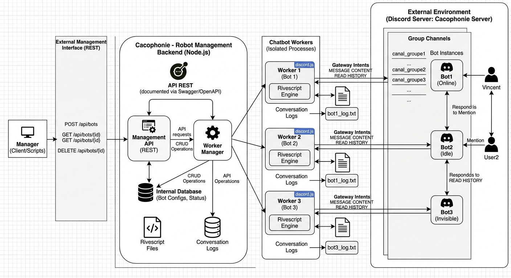

# Projet : Système de gestion de chatbots (Cacophonie)

## 1. Contexte et Objectifs
L'objectif est de concevoir et réaliser **Cacophonie**, une plateforme backend permettant la gestion centralisée (Cycle de vie complet) de robots conversationnels (chatbots) déployés sur Discord.

Ce projet met en pratique les concepts d'architecture distribuée, la gestion de workers, la manipulation d'API et l'interaction avec des services tiers.

Un peu de vocabulaire:
* On distingue deux catagories de personnes: les _administateurs_ qui gèrent les _bots_ et les _utilisateurs_ qui discutent avec les _bots_.
* Attention à bien distinguer les termes _worker_ et _bot_.  
    * Un _worker_ va servir de support à l'exécution d'un _bot_. C'est très prosaiquement un script s'exécutant dans un Worker Thread.
    * Un _bot_ est une entité dont le bu est de discuter avec des _utilisateurs_. Il doit avoir sa personalité : il a un _nom_, un _cerveau_ et une _bouche_. Il peut être actif et discuter (il utilise sa _bouche_ et son _cerveau_) ou en dormance (il n'interagit pas). 

## 2. Architecture Technique
* **Le Backend (l'_API_) :**
    * API RESTful (niveau *HATEOAS*).
    * Gestionnaire de *workers* (base existante fournie).
    * Identification des instances chatsbots comme des ressources/machines d'état ayant un cycle de vie.
* **Les agents conversationnels (les _bots_)**
    * Moteur conversationnel (le _cerveau_) : comment le bot doit répondre à un 'prompt'. L'_API_ doit donner la possibilité de changer le moteur conversationnel d'un _bot_. A minima, ce bot utilisera la technologie  **[Rivescript](https://www.rivescript.com/)** ([lien NPM](https://www.npmjs.com/package/rivescript) pour la documentation et  [bootstrapCodeForRivescriptChatBot](./bootstrapCodeForRivescriptChatBot) pour le code minimal). Cette fonctionalité permettra de faire évoluer nos agents vers des _cerveaux_ utilisants des LLMs.
    * Interface de discussion (la _bouche_) : spécifie sur quel medium le _bot_ perçoit les prompts et donne ses réponses. La encore, l'_API_ doit donner la possibilité de changer la _bouche_. A minima, ce bot utilisera l'interface web locale décrite dans [bootstrapCodeForRivescriptChatBot](./bootstrapCodeForRivescriptChatBot) et le canal discord qui vous a été attribué (cf [bootstrapCodeForDiscordBot](./bootsrapCodeForDiscordBot/)). 
* **Les Workers Threads (les _workers_):**
    * L'_API_ doit être disponible. Vous devez donc déléguer des traitements à des worker threads, en particulier les _bots_ et les _bouches_. 
    *  

## 3. Spécifications Fonctionnelles

### A. Persistance des _bots_ 
Le souvenir des expériences passées fait partie de l'identité d'un _bot_, comme son nom. 
A ce titre, chaque _bot_ doit horodater et archiver ses conversations dans des fichiers locaux dédiés.
De même, il consignera tout changement de _cerveau_ et de _bouche_ (dans un fichier de configuration par exemple).

### B. Gestion des _bots_ 
Le système doit permettre au manager d'effectuer les opérations suivantes sur les _bots_ via des requêtes HTTP :
* **Création/Suppression :** Instanciation d'un nouveau bot lié à un jeton (token) Discord valide.
* **Configuration :** Modification dynamique de la _bouche_ et du _cerveau_ d'un _bot_.
Le système doit permettre au manager de consulter des ressources complémentaires, comme par exemple les _cerveaux_ et les _bouches_ accessibles.
Le manager doit pouvoir extraire l'historique des conversations d'un bot sur une plage temporelle précise via des requêtes GET sur l'API.

### C. Discussion avec un _bot_ avec une _bouche_ Discord
* Vous disposerez d'un pool de 3 _bouches_ Discord mais vous pouvez avoir un plus grand nombre de _bots_ utilisant ces bouches. 
* Dans le cas d'une _bouche_ Discord, le _bot_ ne répond qu'aux prompts qui le mentionne sur le  canal Discord réservé.

<figure>
    
    <figcaption>Schéma indicatif et de toute façon incomplète d'une architecture de Cacophonie</figcaption>
</figure>

## 4. Existant
1. du code fonctionnel et une procédure pour établir un chatbot (non connecté à Rivescript) dans le répertoire [bootstrapCodeForDiscordBot](./bootsrapCodeForDiscordBot/).
2. du code fonctionnel pour créer un agent conversationnel avec Rivescript dans le répertoire [bootstrapCodeForRivescriptChatBot](./bootstrapCodeForRivescriptChatBot).
3. du code fonctionnel pour la gestion d'un pool de workers dans le répertoire [bootstrapCodeForWorkersManagement](./bootstrapCodeForWorkersManagement/).
4. Un exemple complet de gestion de configuration en JSON avec Node.js dans le répertoire [bootstrapCodeForJsonConfig](./bootstrapCodeForJsonConfig/). Cet exemple illustre les bonnes pratiques pour charger, valider et accéder à une configuration depuis des fichiers JSON, avec support des variables d'environnement.

## 5. Livrables Attendus
* **Documentation API :** Spécification détaillée des endpoints  au format OpenAPI/**Swagger**.
* **Code Source :** Code Node.js documenté (JSDoc), déposé sur le GitLab de l'ENSSAT (accès requis pour `@Vincent_Barreaud`).
* **Démonstration :**
    * Screencast vidéo montrant le fonctionnement.
    * Fichier de traces des requêtes (`curl`) utilisées durant la démo.

## 6. Points de vigilance
* **Règles Discord :** Vérifiez bien les permissions (scopes) lors de la création du lien d'invitation (Message Content Intent requis).
* **Mécanique Discord :** Les robots doivent réagir aux messages privés/directs ou aux mentions sur un canal, **non pas** via des commandes slash.
* **Architecture :** l'_API__est uniquement dédiée au contrôle du cycle de vie du bot par le manager. On ne discute pas avec le _bot_ par l'_API_.

---

## 7. Pistes d'amélioration (Fonctionalités Bonus)
* **Suivi d'utilisateurs :**  Faire en sorte que le _bot_ se souvienne de la (date de ) dernière conversation qu'il a eu avec un utilisateur.
* **Gestion de données :** Créer des endpoints pour requêter l'historique global (statistiques par utilisateur, mots-clés les plus fréquents).
* **Dashboard :** Réaliser une interface frontend (UI) pour visualiser les robots et leurs indicateurs en temps réel.

---
